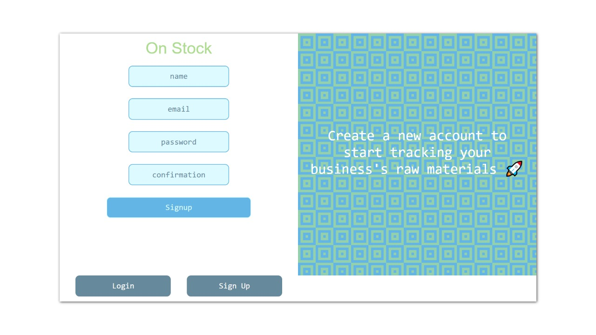

# 📋✅ Raw materials Tracker

This project is part of a series of projects to be completed by students of [Microverse](https://www.microverse.org/).

This project focuses on creating a tracking app where the user can measure something over time.

You can also visit the [Backend](https://github.com/Psiale/coffetory) repository.
## 🧮 The Project Brief

The premise of this project is to create a website that allows the user to create a business and create, see and update the amount of a raw material, see the raw material with the lowest amount on stock and see the list of all the raw materials with a comparision between the initial (or total) and the actual (or remaining) amount on stock.

## 🖼️ Preview



## 🧬 Technologies & Languages Used

- Node.js
- React
- React-DOM
- React-Create-App
- npm
- CSS
- ES6
- Redux

## 🔰 Setup & Usage

### ⌨️ Local 

1. Go to the [repository](https://github.com/Psiale/coffeetory-frontend) and press on the green button that says ```code```
2. Copy the link and open a terminal 

    windows:

    ```windows tab + x ```

    mac: Press ```CmdSpace``` to open spotlight search and type ```terminal``` and hit ```return ```.


3. Go to the folder where you gonna clone the repositorie and type ```git clone PASTE THE LINK``` and hit ```Enter ```

4. Go the the project root and type ``` yarn/npm run start ```

## 🚀 Live version
[visit the page](https://coffeetory.netlify.app)

## 🛎️ Contributions, Issues & Forking

If you have any issues setting up the project or you come across any unintended bugs or problems, please do submit an issue to the [track-app](https://github.com/Psiale/coffeetory-frontend/issues) page.

If you want to make your own changes, modifications or improvements to our project, go ahead and Fork it!
1. [Fork it](https://github.com/Psiale/coffeetory-frontend/fork)
2. Create your working branch (git checkout -b [choose-a-name])
3. Commit your changes (git commit -am 'what this commit will fix/add/improve')
4. Push to the branch (git push origin [chosen-name])
5. Create a new Pull Request

## 🤟🏽😄 😛🤙🏾  Creator

Alexis Sanchez - [Github](https://github.com/Psiale)

## 🙌🏾 Show Your Support

Give a ⭐️ if you like this project!
